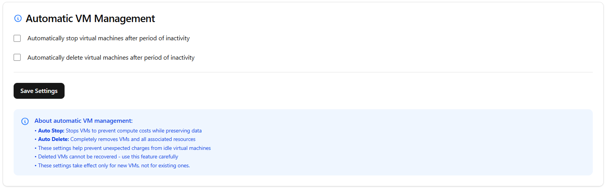

Automatic VM Management
=======================

Automatic VM management is designed to help you reduce costs by automatically stopping unused VMs or deleting them after a period of inactivity.

.. toctree::
   :maxdepth: 2

.. important::

   - Auto Stop: Stops VMs to prevent compute costs while preserving data
   - Auto Delete: Completely removes VMs and all associated resources
   - These settings help prevent unexpected charges from idle virtual machines
   - These settings take effect only for new VMs, not for existing ones.

.. danger::

   Deleted VMs cannot be recovered - use this feature carefully.

