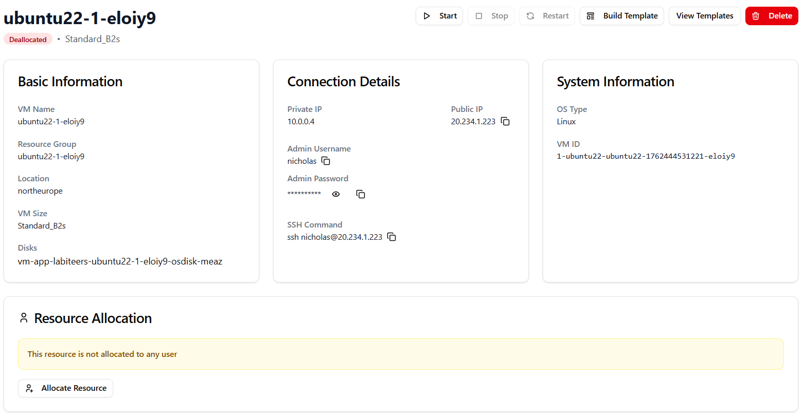

How to allocate a VM to a user 
==============================

To allocate a virtual machine to a user, click the virtual machine and select **Allocate Resource**.

Search for the desired student and click **Allocate**.

