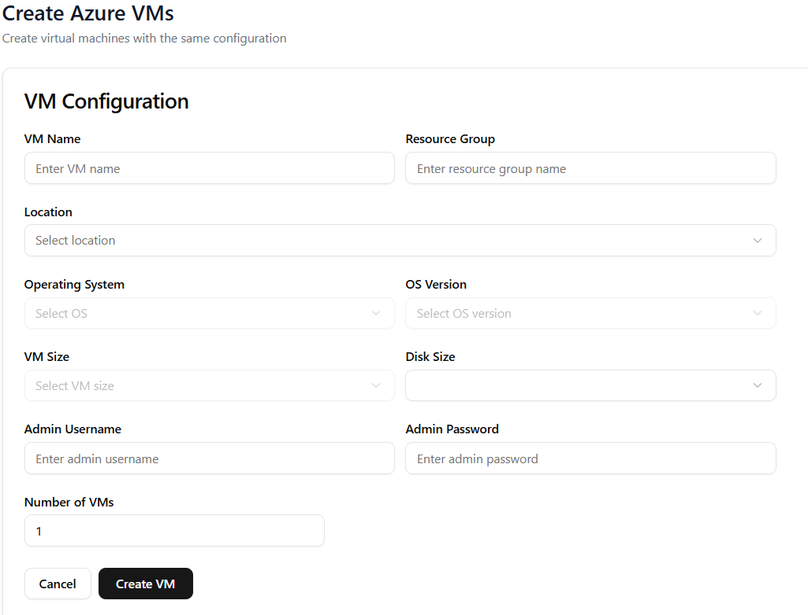

How to create a VM 
==================

To create a virtual machine, click **Create Resource** in the left-hand pane and enter the required details in the window that appears.

Once all fields are filled in, click **Create VM** to complete the process.

After the virtual machine is launched, it appears under the **List Resources** menu.